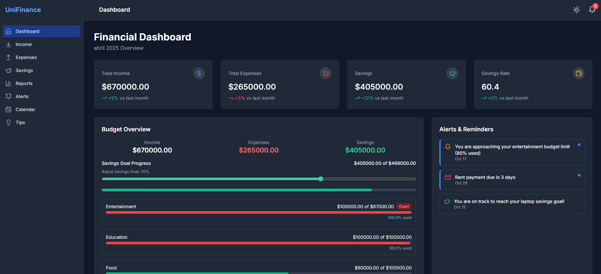

# UniFinance 🏦✨

> Student Financial Management Platform — made to help students track their expenses, savings, and budgets easily.

---

## 🚀 Project Overview

**UniFinance** is a modern financial management web app built with **Vite**, **React**, and **TailwindCSS**.  
Designed especially for students, it allows easy tracking of:

- 💵 Income and expenses
- 🎯 Budgets per category
- 📈 Savings goals
- 📋 Recent transactions

---

## 📸 Preview



---

## 🛠️ Tech Stack

- **Frontend:** React + TypeScript
- **Build Tool:** Vite
- **Styling:** TailwindCSS
- **Icons:** Lucide
- **State Management:** Zustand (custom store)
- **Date Handling:** date-fns
- **Forms:** React Hook Form (future enhancement)

---

## 🔧 Local Setup

Follow these steps to run the project locally:

```bash
# 1. Clone the repository
git clone https://github.com/your-username/unifinance.git
cd unifinance

# 2. Install dependencies
npm install
# or
yarn install
# or
pnpm install

# 3. Start the development server
npm run dev
# or
yarn dev
# or
pnpm dev
